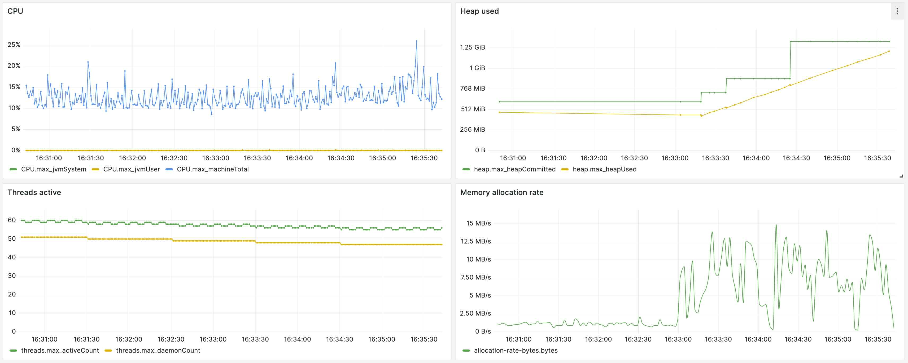
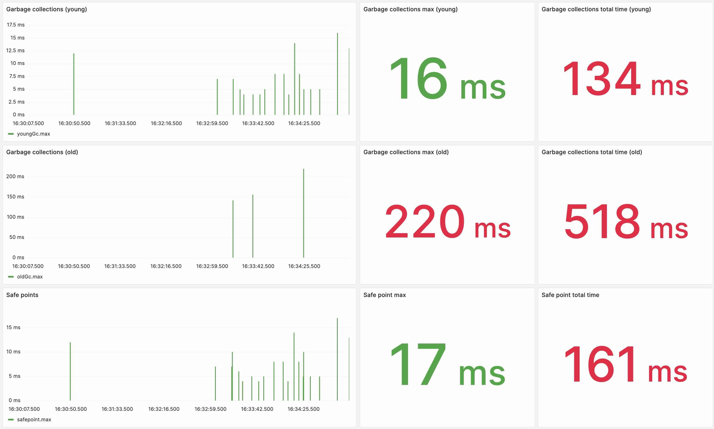
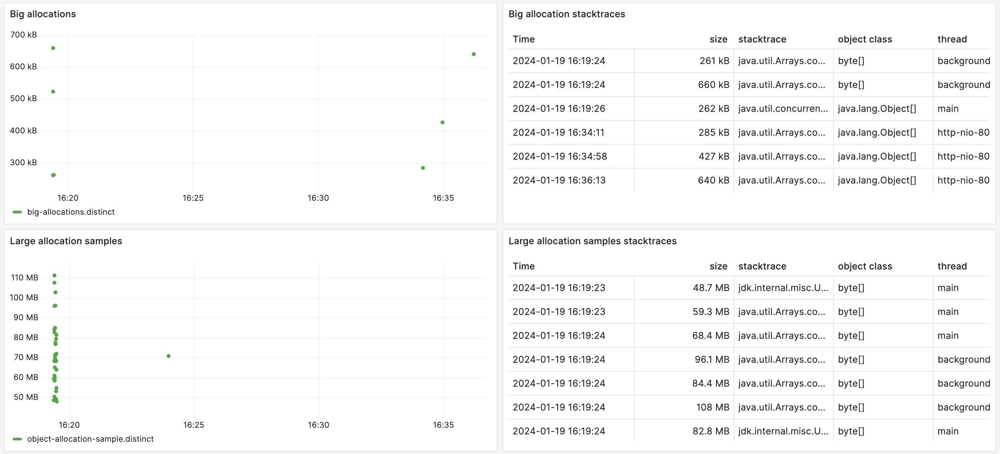
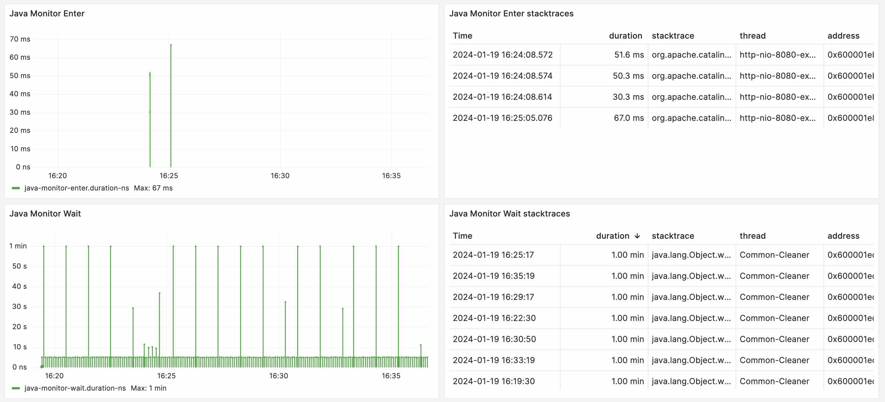
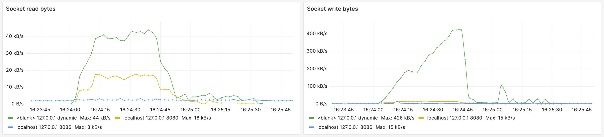
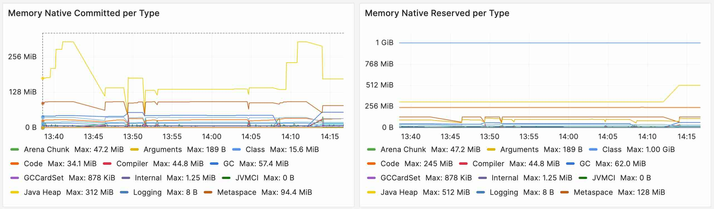
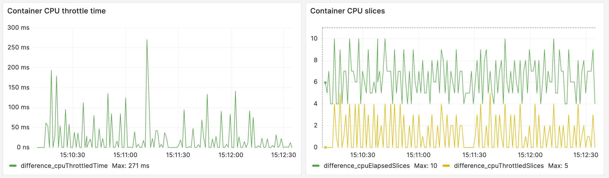
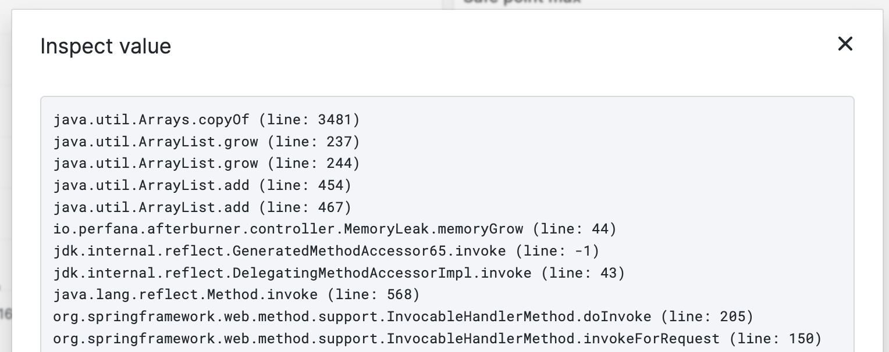

# JfrExporter

Send JFR events to time series databases.

Now in "beta", feedback welcome!

See tutorial in this [blog post](https://perfana.io/continuous-deep-dive-with-jfr-events/).

[](https://www.youtube.com/watch?v=rAq2Xo-VoVc)

Makes use of [JFR Event Streaming](https://openjdk.org/jeps/349) as found in hotspot based JDK 14+.

The InfluxDB time series database is used as storage for the metrics.

The metrics are displayed in a Grafana dashboard, as shown in the following screenshots.

CPU, Heap, Threads and Memory Allocation Rate:


Garbage Collection events:


Large allocation samples and Big Allocations:


Java Monitor waits and enters:


Network reads and writes:


Native memory usage:


Container CPU throttle:


For some events stacktraces are present, such as where in the code a big memory allocation took place.
(see screenshot below)

## Steps

To use JfrExporter:

1. create a database in InfluxDB (or use an existing one)
2. download and put the agent jar on the classpath, point it to InfluxDB
3. create a datasource in Grafana for the InfluxDB database
4. import the Grafana dashboard from the `dashboards` directory, choose InfluxDB datasource
5. start the application
6. optional: start load test

## Download

Direct [download version 0.5.0](https://github.com/perfana/jfr-exporter/releases/download/0.5.0/jfr-exporter-0.5.0.jar)

Download the latest release from the [releases page](https://github.com/perfana/jfr-exporter/releases).

## Agent

To use JfrExporter simply add `-javaagent:/path/to/jfr-exporter.jar` to your JVM arguments.

There is no need to enable JFR in the JVM arguments (`-XX:StartFlightRecording`).

Options can be sent as `-javaagent:/path/to/jfr-exporter.jar=option1=value1,option2=value2`.

Example: `-javaagent:/path/to/jfr-exporter.jar=debug,tag=service/afterburner`, which will enable
debug logging and set the tag `service` to `afterburner`.

When used as agent, there is no need to add JFR activation to the JVM arguments.

Be aware that some shells require a backslash before the equal signs.

## Standalone

JfrExporter can also be used as a standalone application, for example to monitor a running process.

The monitored process needs to be started with JFR enabled: `-XX:StartFlightRecording`

```bash
Usage: java JfrExporter 
 --debug,-d 
 --disableStackTraces
 --processId,-p <processId> 
 --duration <ISO-duration> 
 --tag <tag-name>/<tag-value>,
 --bigObjectThreshold <bytes>
 --bigObjectSampleWeightThreshold <bytes>
 --influxUrl <influxUrl> 
 --influxDatabase <influxDatabase>
 --influxUser <influxUser> 
 --influxPassword <influxPassword>

```

Multiple tags can be specified.

The default InfluxDB database name is `jfr`.

Use `--disableStackTraces` to limit stack traces to only the first three frames.

Example to connect to process with id 1234 and send events with service name afterburner-fe:
```bash
java -jar jfr-exporter.jar --processId 1234 \
  --tag service/afterburner-fe --tag systemUnderTest/afterburner --tag testEnvironment/performance-test \
  --duration PT30s --influxUrl http://localhost:8086
```

To enable extra monitoring, such as safe points, or different thresholds, 
use a saved JFR profile in the JDK used, for example saved as `mySettings`: `-XX:StartFlightRecording:settings=mySettings`

## Events

These JFR events are processed: 
* CPU load
* Thread count
* Classes loaded
* Garbage Collection (GC) events
* Safe points
* Memory (heap usage, large allocations)
* Network read/write
* Java Monitor waits and enters
* Native Memory usage
* Container CPU and Memory (CPU Throttling, Memory request exceeded count)
* Thread context switch rate

For reference: [list of JFR events](https://sap.github.io/SapMachine/jfrevents/).

## Stack traces

Stack traces for several events are sent to InfluxDB.
Via the dashboard you can see the details by clicking in the stacktrace columns.

Example of a big memory allocation stacktrace:


## Native Memory

To see the native memory usage, enable Native Memory Tracking (NMT) on the process command line by adding:

    -XX:NativeMemoryTracking=summary
    
## Dashboard

A Grafana dashboard can be imported to view the JFR metrics.

Import the dashboard in the `dashboards` directory into Grafana and
connect to an InfluxDB datasource that points to the `jfr` database.

For the dashboards to work, use the following tags:

    tag=service/<service>,tag=systemUnderTest/<systemUnderTest>,tag=testEnvironment/<testEnvironment>

For example:

    tag=service/afterburner-fe,tag=systemUnderTest/afterburner,tag=testEnvironment/performance-test

These tags are used to select the proper data for the test runs in the dashboard.

For version 0.5.0 and above use dashboard `jfr-dashboard-export-share-0.5.json`.

## Troubleshoot

Use `-Dio.perfana.jfr.debug=true` to enable debug logging or `--debug` as argument.

For tracing (more debug logging) use: `-Dio.perfana.jfr.trace=true`

Debug and tracing will output a lot of data, so only use for troubleshooting.

